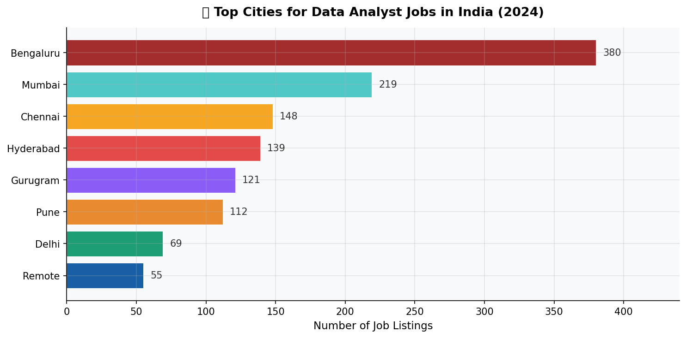
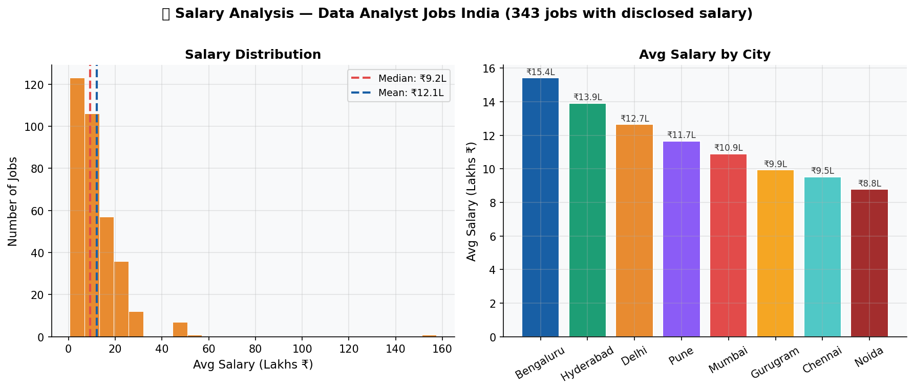
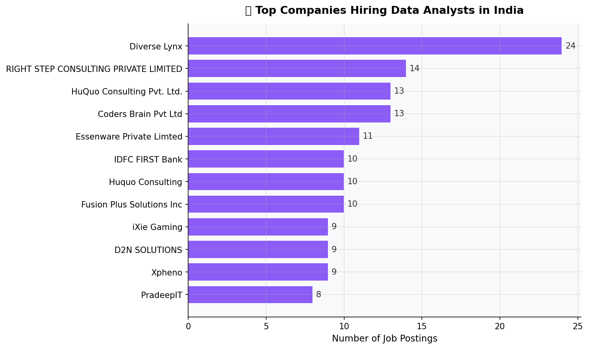
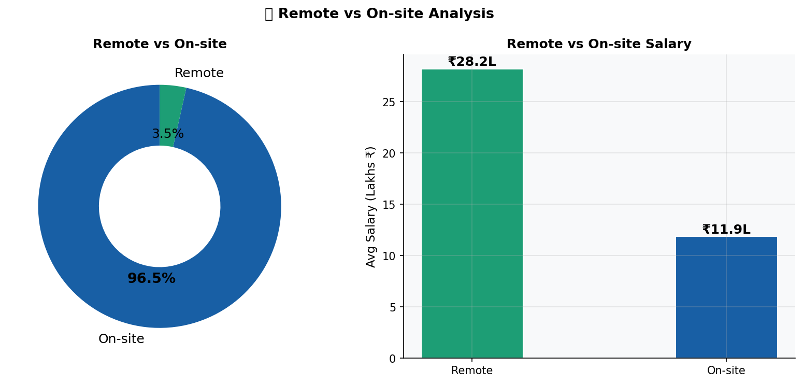
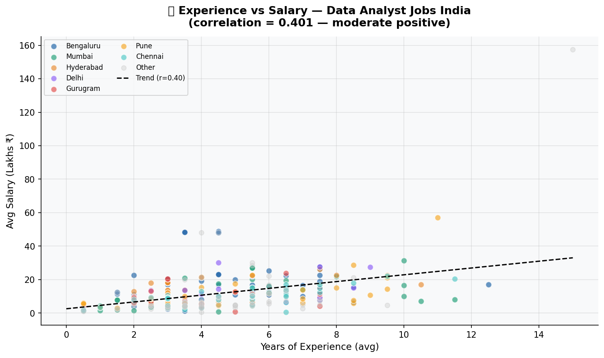
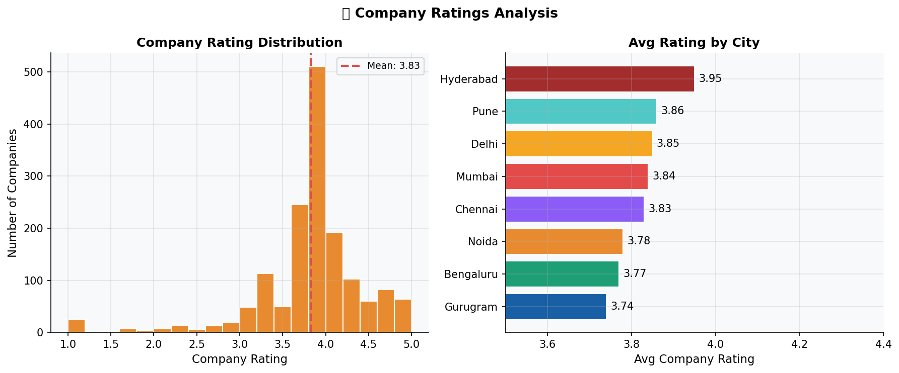

# 📊 Data Analyst Jobs India — 2024 EDA


## 🖼️ Project Preview
| | |
|---|---|
|  |  |
|  |  |
|  |  |

## 🔍 About
EDA of **1,561 Data Analyst job listings** scraped from
Naukri, Hirist & IIMJobs on July 2024.

## 💡 Key Insights
- 🏙️ Bengaluru = #1 city — 380 jobs, ₹15.4L avg salary
- 🛠️ SQL is #1 skill — found in 281 listings
- 🐍 Python (154) + Power BI (133) = winning combo
- 💰 Median salary = ₹9.2L | Mean = ₹12.1L (inflated by outliers)
- 📈 48.2% of jobs want 2–5 years experience
- 🌐 Only 3.5% jobs are remote — but pays ₹28.2L avg
- ⭐ Hyderabad has highest company rating (3.95 avg)
- 📉 Experience vs Salary correlation = 0.401 (moderate positive)

## 📊 Analysis Charts

| Chart | Title |
|-------|-------|
| 1 | 🏙️ Top Cities for Data Analyst Jobs |
| 2 | 🛠️ Top 15 In-Demand Skills |
| 3 | 💰 Salary Analysis & Distribution |
| 4 | 📈 Job Demand by Experience Level |
| 5 | 🏢 Top Companies Hiring |
| 6 | 🌐 Remote vs On-site Analysis |
| 7 | ⭐ Company Ratings Analysis |
| 8 | 📉 Experience vs Salary Correlation |

## 🛠️ Tools Used
- **Python** — core programming
- **Pandas** — data cleaning & analysis
- **Matplotlib** — 8 visualisation charts
- **Jupyter Notebook** — analysis environment

## 📁 Files
| File | Description |
|------|-------------|
| `data/` | Raw & cleaned CSV dataset |
| `charts/` | 8 analysis charts |
| `notebooks/` | Jupyter notebook with full code |
| `report/` | Visual HTML report |

## 🚀 How to Run
```bash
pip install pandas matplotlib jupyter
jupyter notebook notebooks/eda_analysis.ipynb
```

## 🌐 Live Report
👉 [Click here to view the full report](https://saibharath0618.github.io/Data-Analyst-Jobs-India-2024-EDA/)

## 📅 Dataset
- Source: Naukri, Linkdin
- Date: 7th July 2024
- Records: 1,561 listings | 10 cities

## 🙋 About Me
**Patakanoor Sai Bharath** — Aspiring Data Analyst
Passionate about turning raw data into actionable insights.

[](https://www.linkedin.com/in/patakanoor-sai-bharath-02643125b)
[](https://github.com/saibharath0618)
